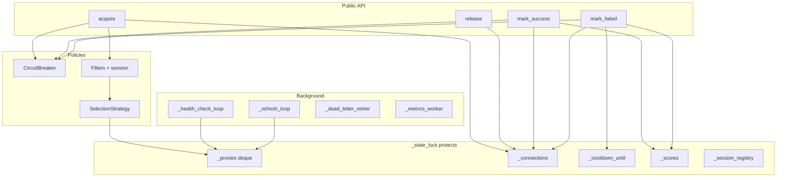
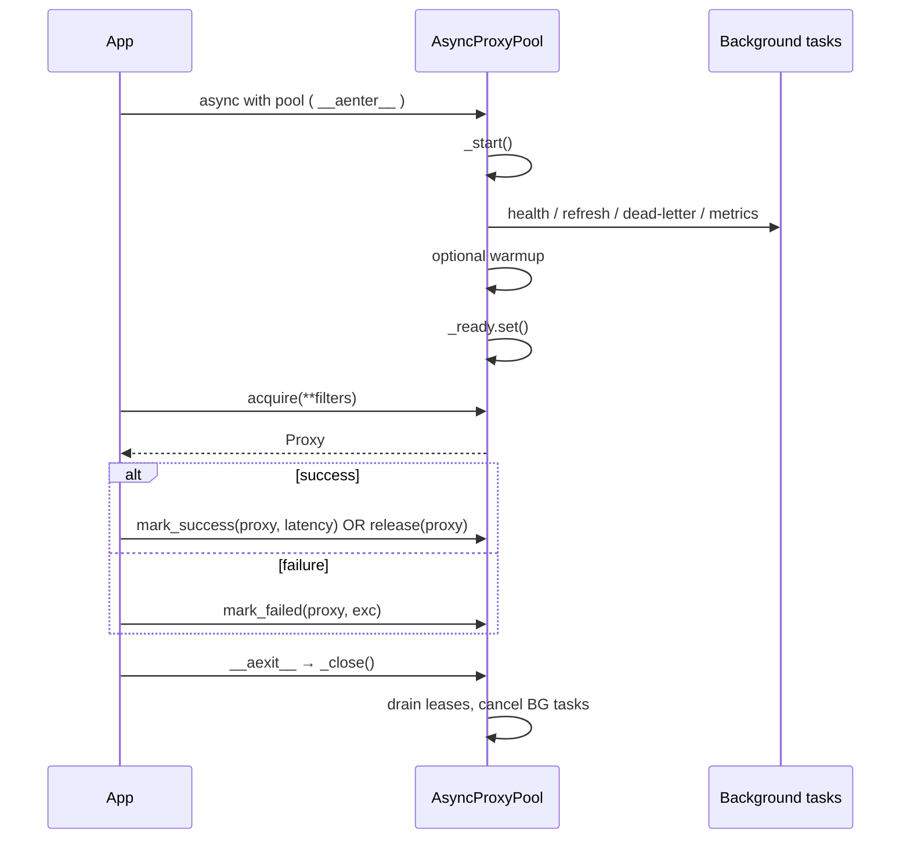
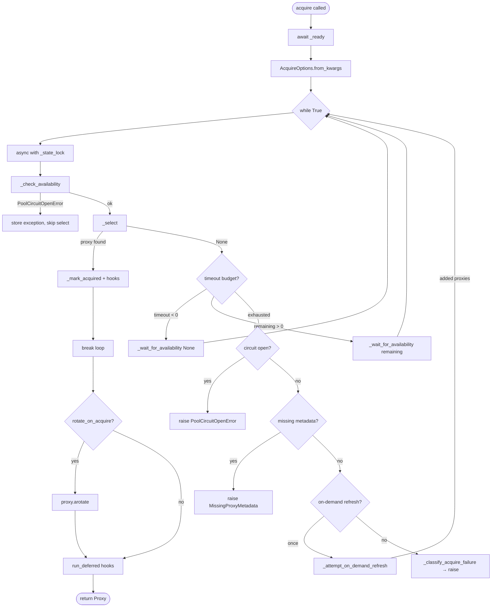
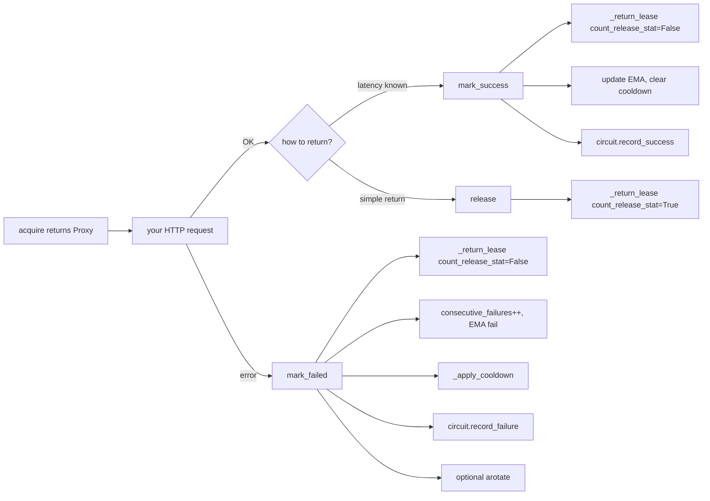
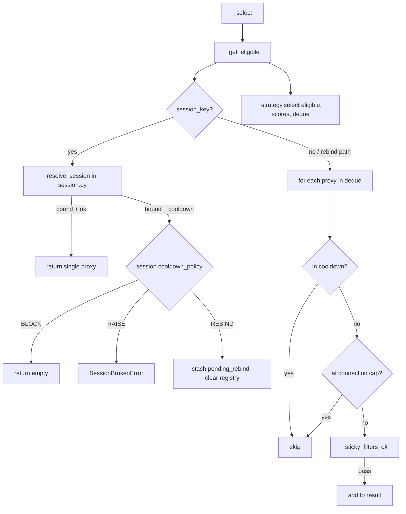
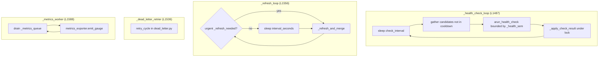

# AsyncProxyPool — step-by-step walkthrough

Follow the proxy pool logic in order, or jump to any section via the table of contents.
All line references point at [`omniproxy/pool.py`](../omniproxy/pool.py).

---

## Table of contents

1. [Mental model](#1-mental-model)
2. [Usage lifecycle](#2-usage-lifecycle)
3. [Internal state (what each field tracks)](#3-internal-state)
4. [Startup & shutdown](#4-startup--shutdown)
5. [Acquire — the main loop](#5-acquire--the-main-loop)
6. [After acquire — release / success / failure](#6-after-acquire)
7. [Selection & filtering pipeline](#7-selection--filtering-pipeline)
8. [Background workers](#8-background-workers)
9. [Refresh & merge](#9-refresh--merge)
10. [Health checks & dead letter](#10-health-checks--dead-letter)
11. [Method index by role](#11-method-index-by-role)
12. [External modules](#12-external-modules)
13. [Exceptions you can hit](#13-exceptions)

---

## 1. Mental model

`AsyncProxyPool` is a **lease manager** over a `deque[Proxy]`:

| Concept | Meaning |
|---------|---------|
| **Proxy in deque** | Candidate in the pool (may be cooling down or at cap) |
| **Lease** | `_connections[url]` counter incremented on `acquire`, decremented on `release` / `mark_*` |
| **Eligible** | Passes filters, not in cooldown, under connection cap |
| **Strategy** | Picks one proxy from eligible list (round-robin, random, weighted, lowest-latency) |
| **Circuit breaker** | Pool-wide gate; when open, `acquire` waits or raises |
| **Sticky session** | `session_key` binds to one proxy URL until TTL or rebind |



**SyncProxyPool** (`pool.py` L1663+) is a thin wrapper: daemon thread + event loop, delegates every call to `AsyncProxyPool`.

---

## 2. Usage lifecycle



**Rule:** Call exactly one of `release`, `mark_success`, or `mark_failed` per acquisition — not `release` + `mark_success`.

---

## 3. Internal state

Built in `__init__` (L157–221):

| Field | Type | Purpose |
|-------|------|---------|
| `_proxies` | `deque[Proxy]` | Ordered pool; front evicted when `max_size` exceeded |
| `_connections` | `dict[str, int]` | Active leases per proxy URL |
| `_cooldown_until` | `dict[str, float]` | Monotonic timestamp when cooldown ends |
| `_scores` | `dict[str, EMAState]` | EMA success/latency for weighted / lowest-latency strategies |
| `_consecutive_failures` | `dict[str, int]` | Drives cooldown threshold |
| `_session_registry` | `dict[str, SessionEntry]` | Sticky session → proxy URL + expiry |
| `_pending_session_rebind` | `dict[str, Proxy]` | Old proxy waiting for `on_session_rebind` hook |
| `_circuit_breaker` | `CircuitBreaker \| None` | Pool-wide failure shedding |
| `_half_open_probe_*` | epoch, url, proxy | Tracks HALF_OPEN probe acquisition |
| `_strategy` | `SelectionStrategy` | Built from `config.strategy` |
| `_dead_letter_queue` | `list` | Proxies awaiting retry (see `dead_letter.py`) |
| `_refresh_needed` | `bool` | Urgent refresh when below `min_size` |
| `_refresh_generation` | `int` | Coalesces concurrent on-demand refreshes |
| `_statistics` | `PoolStatistics` | served / failed / released / exhausted_count |
| `_ready` | `Event` | Blocks `acquire` until startup completes |
| `_draining` | `Event` | Set during shutdown |
| `_state_lock` + `_available_cond` | `Lock` + `Condition` | Serialize state; wake waiters |
| `_refresh_lock` | `Lock` | One refresh at a time |
| `_close_lock` | `Lock` | Idempotent close |

Locks: **always** mutate pool state under `_state_lock`. Refresh uses `_refresh_lock` then takes `_state_lock` inside `_merge_new_proxies`.

---

## 4. Startup & shutdown

### Startup chain

```
__aenter__  →  _start  →  spawn background tasks  →  optional warmup  →  _ready.set()
```

| Step | Method | Lines | What happens |
|------|--------|-------|--------------|
| 1 | `_start` | L256 | Guard closed / already ready |
| 2 | `_stop_background_tasks` | L335 | Cancel any stale tasks |
| 3 | Create tasks | L280–301 | `_health_check_loop`, `_dead_letter_retrier`, `_refresh_loop`, `_metrics_worker` — each optional via config |
| 4 | Warmup | L303–329 | `run_warmup` + hooks; may `raise WarmupFailedError` |
| 5 | Ready | L330 | `_ready.set()` — unblocks `acquire` |

On any startup exception: `_close()` then re-raise.

### Shutdown chain

```
__aexit__ / close  →  _close  →  drain  →  _closed=True  →  _stop_background_tasks
```

| Step | Method | Lines | What happens |
|------|--------|-------|--------------|
| 1 | `_draining.set()` | L379 | New acquires get `PoolDrainingError` |
| 2 | Wait for leases | L392–402 | Until `_connections` sum is 0 or `drain_timeout` |
| 3 | `_closed = True` | L404 | Permanent |
| 4 | Cancel BG tasks | L408 | Health, refresh, metrics, dead-letter |

---

## 5. Acquire — the main loop

Entry: `acquire` (L552). This is the heart of the pool.



### Step-by-step (one iteration)

1. **`await self._ready.wait()`** — pool must be started.
2. **`AcquireOptions.from_kwargs`** — merge caller filters with pool defaults (`tags`, `accept_callback`, `session_id` alias).
3. **Under `_state_lock`:**
   - **`_check_availability`** — closed? draining? circuit open?
   - **`_append_circuit_hooks`** — queue open/close hook callbacks.
   - **`_select(options)`** → if proxy:
     - **`_mark_acquired`** — bump lease, stats, session bind, HALF_OPEN probe tag.
     - Queue `on_proxy_acquired`; maybe `on_session_rebind`.
     - **break** out of loop.
4. **If no proxy:** wait on `_available_cond` (respects `acquire_timeout` and next cooldown wakeup via `_bounded_wait_timeout`).
5. **When timeout exhausted (still under lock logic, then outside):**
   - Circuit open → `PoolCircuitOpenError`
   - Missing required metadata → `MissingProxyMetadata`
   - Else **one** on-demand refresh via `_attempt_on_demand_refresh`
   - Else **`_classify_acquire_failure`** → `PoolExhausted` / `PoolSaturated` / `NoMatchingProxy`
6. **After loop:** optional `proxy.arotate()` if `rotate_on_acquire`; run deferred hooks; return proxy.

### Waiting helpers

| Method | Role |
|--------|------|
| `_bounded_wait_timeout` | Min of fallback interval, user budget, next cooldown expiry |
| `_wait_for_availability` | `Condition.wait` with bounded timeout |

---

## 6. After acquire



| Method | Lines | Lease | Stats | Scoring | Cooldown | Circuit | Hooks |
|--------|-------|-------|-------|---------|----------|---------|-------|
| `release` | L673 | ✓ released++ | — | — | — | clears HALF_OPEN probe | `on_proxy_released` |
| `mark_success` | L750 | ✓ | — | EMA + | clears | `record_success` | — |
| `mark_failed` | L698 | ✓ | failed++ | EMA − | `_apply_cooldown` | `record_failure` | `on_proxy_failed` |

**Important:** Health-check results (`_apply_check_result`) update scoring/cooldown but **do not** feed the circuit breaker — only client-reported `mark_success` / `mark_failed` do.

---

## 7. Selection & filtering pipeline

Called from `_select` → `_get_eligible` → strategy.



### Filter helpers (all synchronous, called under lock)

| Method | Lines | Role |
|--------|-------|------|
| `_active_metadata_filters` | L906 | country, min_anonymity, tags |
| `_proxy_matches_metadata_filter` | L928 | Per-attribute match logic |
| `_metadata_value_missing` | L887 | None / empty detection |
| `_anonymity_rank` | L870 | transparent < anonymous < elite |
| `_sticky_filters_ok` | L1054 | All metadata + `accept_callback` |
| `_at_connection_cap` | L1038 | vs `limits.max_connections_per_proxy` |
| `_any_filter_match` | L1024 | Any proxy passes filters (for error typing) |
| `_missing_metadata_message` | L960 | For `FilterMissingMetadata.RAISE` |
| `_classify_acquire_failure` | L990 | Pick Exhausted / Saturated / NoMatchingProxy |

### Strategy selection

`_build_strategy` (L425) maps `PoolStrategy` enum → class in `strategies.py`:

- `ROUND_ROBIN` → `RoundRobinStrategy` (uses full deque for fair rotation)
- `RANDOM` → `RandomStrategy`
- `WEIGHTED` → `WeightedStrategy` (uses `_scores`)
- `LOWEST_LATENCY` → `LowestLatencyStrategy` (uses `_scores`)

---

## 8. Background workers

Started in `_start`, cancelled in `_stop_background_tasks`.



| Worker | Config gate | Locking |
|--------|-------------|---------|
| Health | `config.health_check` | Snapshot candidates outside lock; apply inside |
| Refresh | fetchers or refresh callbacks | `_refresh_lock` → `_state_lock` on merge |
| Dead letter | `dead_letter.enabled` | `retry_cycle` uses `_state_lock` |
| Metrics | `metrics_exporter` | Queue only; worker isolated |

---

## 9. Refresh & merge

On-demand (from `acquire`) and periodic (background) share the same merge path.

```
_attempt_on_demand_refresh
  → _refresh_lock (coalesce via _refresh_generation)
  → _refresh_and_merge
       → _fetch_new_proxies (refresh.py)
       → _merge_new_proxies
       → _check_min_size (may set _refresh_needed)
```

| Method | Lines | Role |
|--------|-------|------|
| `_fetch_new_proxies` | L1348 | Callbacks beat fetchers |
| `_refresh_and_merge` | L1374 | Hooks, fetch, merge, bump generation |
| `_merge_new_proxies` | L1416 | Dedupe by URL; evict front if `max_size` |
| `_evict_proxy` | L1292 | Clean all bookkeeping for one URL |
| `_has_refresh_source` | L1446 | Fetchers or callbacks configured? |
| `_check_min_size` | L1465 | Warn + flag urgent refresh |

---

## 10. Health checks & dead letter

### Health check result path

`_record_health_check_result` (async wrapper) → `_apply_check_result` (L1220):

- Proxy still in pool? (URL set membership)
- **Success:** clear failures, update EMA, clear cooldown, hooks `on_check_complete` + `on_proxy_recovered`
- **Failure:** failed stat, failures++, EMA, `_apply_cooldown`, hooks `on_check_complete` + `on_proxy_failed`

### Cooldown application

`_apply_cooldown` (L1171):

1. Skip if `consecutive_failures < failure_threshold`
2. Duration from custom `cooldown.strategy` or `compute_cooldown` (`cooldown.py`)
3. Store `monotonic() + duration` in `_cooldown_until`

### Warmup (startup only)

Uses `_unchecked_proxies` + `run_warmup` (`warmup.py`) — not repeated here; runs before `_ready`.

---

## 11. Method index by role

Quick lookup — every method on `AsyncProxyPool`.

### Lifecycle & context

| Method | Lines |
|--------|-------|
| `__init__` | 157 |
| `__aenter__` | 223 |
| `__aexit__` | 240 |
| `_start` | 256 |
| `_close` | 361 |
| `close` | 410 |
| `_stop_background_tasks` | 335 |

### Public acquire / release API

| Method | Lines |
|--------|-------|
| `acquire` | 552 |
| `release` | 673 |
| `mark_failed` | 698 |
| `mark_success` | 750 |
| `statistics` (property) | 1650 |

### Availability & waiting

| Method | Lines |
|--------|-------|
| `_check_availability` | 824 |
| `_bounded_wait_timeout` | 476 |
| `_wait_for_availability` | 507 |
| `_return_lease` | 526 |

### Selection & filters

| Method | Lines |
|--------|-------|
| `_select` | 851 |
| `_get_eligible` | 1079 |
| `_mark_acquired` | 1138 |
| `_build_strategy` | 425 |
| `_sticky_filters_ok` | 1054 |
| `_active_metadata_filters` | 906 |
| `_proxy_matches_metadata_filter` | 928 |
| `_metadata_value_missing` | 887 |
| `_anonymity_rank` | 870 |
| `_at_connection_cap` | 1038 |
| `_any_filter_match` | 1024 |
| `_missing_metadata_message` | 960 |
| `_classify_acquire_failure` | 990 |

### Failure accounting

| Method | Lines |
|--------|-------|
| `_apply_cooldown` | 1171 |
| `_apply_check_result` | 1220 |
| `_record_health_check_result` | 808 |
| `_count_consecutive_failures` | 1278 |
| `_evict_proxy` | 1292 |
| `_unchecked_proxies` | 794 |

### Refresh

| Method | Lines |
|--------|-------|
| `_attempt_on_demand_refresh` | 1328 |
| `_fetch_new_proxies` | 1348 |
| `_refresh_and_merge` | 1374 |
| `_merge_new_proxies` | 1416 |
| `_has_refresh_source` | 1446 |
| `_check_min_size` | 1465 |
| `_refresh_loop` | 1556 |

### Background & metrics

| Method | Lines |
|--------|-------|
| `_health_check_loop` | 1487 |
| `_dead_letter_retrier` | 1536 |
| `_metrics_worker` | 1588 |
| `_emit_stat_metric` | 1607 |
| `_enqueue_metric` | 1629 |

### Hooks & circuit

| Method | Lines |
|--------|-------|
| `_append_circuit_hooks` | 451 |

### Supporting types (same file)

| Type | Lines |
|------|-------|
| `AcquireOptions` | 42 |
| `AcquireOptions.from_kwargs` | 72 |
| `PoolStatistics` | 110 |
| `SyncProxyPool` | 1663 |

---

## 12. External modules

| Module | Used for |
|--------|----------|
| [`config.py`](../omniproxy/config.py) | `PoolConfig` and all sub-configs |
| [`strategies.py`](../omniproxy/strategies.py) | `SelectionStrategy` implementations |
| [`scoring.py`](../omniproxy/scoring.py) | `EMAState`, `update_ema` |
| [`cooldown.py`](../omniproxy/cooldown.py) | `compute_cooldown`, `is_in_cooldown` |
| [`circuit_breaker.py`](../omniproxy/circuit_breaker.py) | `CircuitBreaker`, `allow_request`, HALF_OPEN |
| [`session.py`](../omniproxy/session.py) | `resolve_session`, `SessionEntry` |
| [`hooks.py`](../omniproxy/hooks.py) | `run_deferred` for lifecycle callbacks |
| [`refresh.py`](../omniproxy/refresh.py) | `fetch_from_fetchers`, `fetch_from_refresh_config` |
| [`warmup.py`](../omniproxy/warmup.py) | Startup warmup |
| [`dead_letter.py`](../omniproxy/dead_letter.py) | `retry_cycle` |
| [`extended_proxy.py`](../omniproxy/extended_proxy.py) | `Proxy`, `arun_health_check` |
| [`errors.py`](../omniproxy/errors.py) | Pool exception types |

**PlantUML diagrams** (render with any PlantUML viewer): [`docs/diagrams/omniproxy.puml`](diagrams/omniproxy.puml) — see `omniproxy-acquire-sequence` and `omniproxy-classes` diagrams.

---

## 13. Exceptions

### From `acquire`

| Exception | When |
|-----------|------|
| `PoolClosedError` | After `_closed` |
| `PoolDrainingError` | During shutdown drain |
| `PoolCircuitOpenError` | Breaker open; timeout exhausted while still open |
| `PoolExhausted` | No usable proxies (empty pool, all cooling down, etc.) |
| `PoolSaturated` | Matches exist but all at connection cap or cooling down |
| `NoMatchingProxy` | Filters exclude every proxy |
| `MissingProxyMetadata` | `filter_missing_metadata=RAISE` and required field missing on all |
| `SessionBrokenError` | Sticky session proxy in cooldown with `RAISE` policy |
| `WarmupFailedError` | Startup only, if warmup policy is `RAISE` |

### Decision tree for acquire failure (after timeout)

```
_proxies empty?           → PoolExhausted
filters active & no match → NoMatchingProxy
all matching capped/CD?   → PoolSaturated or PoolExhausted
else                      → PoolExhausted
```

---

## Suggested reading order

If you are tracing code for the first time:

1. `__init__` — know the fields
2. `_start` / `_close` — lifecycle
3. `acquire` — main loop (use §5 flowchart)
4. `_get_eligible` + `_select` — who gets picked
5. `mark_success` / `mark_failed` / `release` — how state moves back
6. `_health_check_loop` + `_refresh_loop` — background maintenance
7. Jump to `circuit_breaker.py`, `session.py`, `strategies.py` as needed
